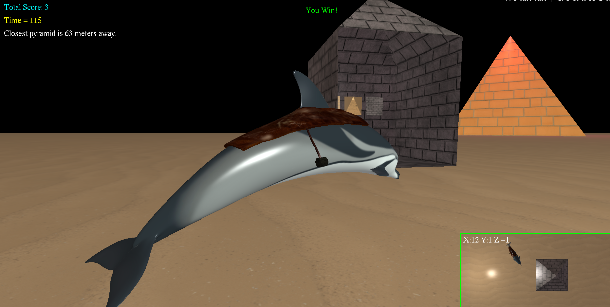
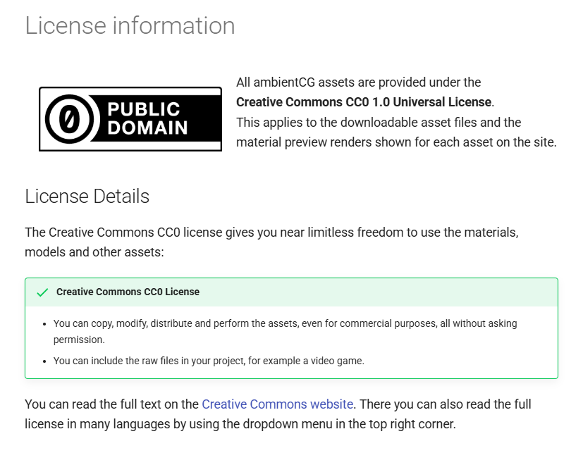
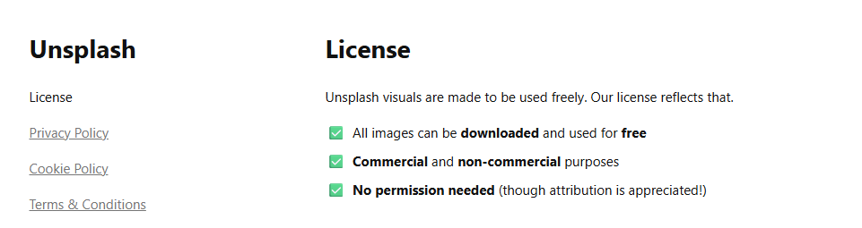

# 🐬🏺 Dolphin Archaeologist

> Navigate a desert environment, photograph ancient pyramids, and return home to display your discoveries.

---

## 1. Developer
**Developer:** Maksim Shkrabak  
**Course:** CSC-165 Section 1   
**Assignment:** A2 - Dolphin Archaeologist - Spring 2026

## 2. Typical Gameplay Scene

---

## 3. 🎮 Dolphin Movement Controls

### Keyboard
| Action                      | Input     |
|:----------------------------|:----------|
| **Move Forward / Backward** | `W` / `S` |
| **Yaw (Turn) Left / Right** | `A` / `D` |

### Gamepad
| Action                      | Input               |
|:----------------------------|:--------------------|
| **Move Forward / Backward** | Left Stick (Y-Axis) |
| **Yaw (Turn) Left / Right** | Left Stick (X-Axis) |

---

## 4. Camera & Viewport Controls

### Orbit Camera (Main Viewport)
| Action            | Input          |
|:------------------|:---------------|
| **Orbit Camera**  | Mouse Movement |
| **Zoom In / Out** | Scroll Wheel   |
| **Orbit Camera**  | Right Stick    |
| **Zoom In / Out** | `RB` / `LB`    |

### Overhead Mini Viewport
| Action            | Input                      |
|:------------------|:---------------------------|
| **Pan Camera**    | `↑` `↓` `←` `→` Arrow Keys |
| **Zoom In / Out** | `I` / `O`                  |
| **Pan Camera**    | `D-Pad (+)`                |
| **Zoom In**       | Right Stick (Press Down)   |
| **Zoom Out**      | Left Stick (Press Down)    |

### Other
| Action                | Input                                               |
|:----------------------|:----------------------------------------------------|
| **Take Picture**      | `P` / `Button Y` *(within 10.0 units)*              |
| **Transfer Pictures** | `Spacebar` / `Button B` *(near home, all 3 photos)* |
| **Toggle World Axes** | `X` / `Button X`                                    |

---

## 5. Node Controllers

**`RotationController`** *(built-in TAGE)*: Rotates a target GameObject continuously around a specified axis at a given speed. Each pyramid has its own `RotationController` attached at startup with the controller disabled. It is enabled only when the player successfully photographs that pyramid, causing it to spin in place as visual confirmation of the discovery.

**`JumpController`** *(custom)*: Causes a target GameObject to bounce up and down using a sine wave function. A base Y position is recorded on the first frame so the object always bounces relative to its original position. Bounce height and speed are configurable. In this game it is attached to the dolphin home and enabled when the player wins, causing the house to bounce.

---

## 6. 🔧 TAGE Engine Modifications

* **`GameObject.java`:** Added `globalYaw()` to rotate the dolphin around the world Y-axis, preventing unwanted roll when turning.
* **`GameObject.java`:** Added `pitch()` to allow complex 3D rotation logic.
* **`GameObject.java`:** Added `spawnObject(...)` static helper method to streamline object creation by handling translation, scaling, and Y-axis rotation in a single call.
* **`HUDmanager.java`:** Expanded to support additional HUD slots for game state and action messaging.
* **`Camera.java`:** Added `yaw()` and `pitch()` methods to support the orbit camera controller.
* **`CameraOrbit3D.java`** *(new class)*: Custom orbital camera controller allowing the player to orbit, elevate, and zoom the camera around the dolphin independently of the dolphin's movement and orientation.
* **`JumpController.java`** *(new class, added to `nodeControllers` subpackage)*: Custom node controller that causes a target object to bounce using a sine wave.

---

## 7. ⚠️ Unimplemented Requirements

* All requirements have been fulfilled.

---

## 8. 📝 Assets & Licensing

| Asset                        | Type     | Source                                  | License                       |
|:-----------------------------|:---------|:----------------------------------------|:------------------------------|
| **Dolphin Model**            | 3D Model | Provided by Professor (DolphinRide.zip) | Distributed for course use    |
| **Saddle Model**             | 3D Model | Created by Me (Blender)                 | Original Work                 |
| **Dolphin House**            | 3D Model | Created by Me (ManualObject)            | Original Work                 |
| **Saddle Texture**           | Texture  | https://unsplash.com/                   | Unsplash License — see below  |
| **Desert Ground Texture**    | Texture  | https://ambientcg.com/                  | CC0 1.0 Universal — see below |
| **Khafre Pyramid Texture**   | Texture  | https://ambientcg.com/                  | CC0 1.0 Universal — see below |
| **Khufu Pyramid Texture**    | Texture  | Created by Me (Hand-drawn)              | Original Work                 |
| **Menkaure Pyramid Texture** | Texture  | Provided by Professor (DolphinRide.zip) | Distributed for course use    |
| **Plane / Line Shapes**      | Shapes   | TAGE Engine                             | Built-in Engine Shapes        |

Assets from [ambientCG.com](https://ambientcg.com/) (`desert.jpg`, `khafreTexture.jpg`) are released under the **CC0 1.0 Universal License.**

*ambientCG CC0 1.0 license confirmation.*

*Unsplash license confirmation.*

---

## 9. Lab Verification

I verified my program works correctly on the ECS-MARIO lab computer in RVR-5029.
